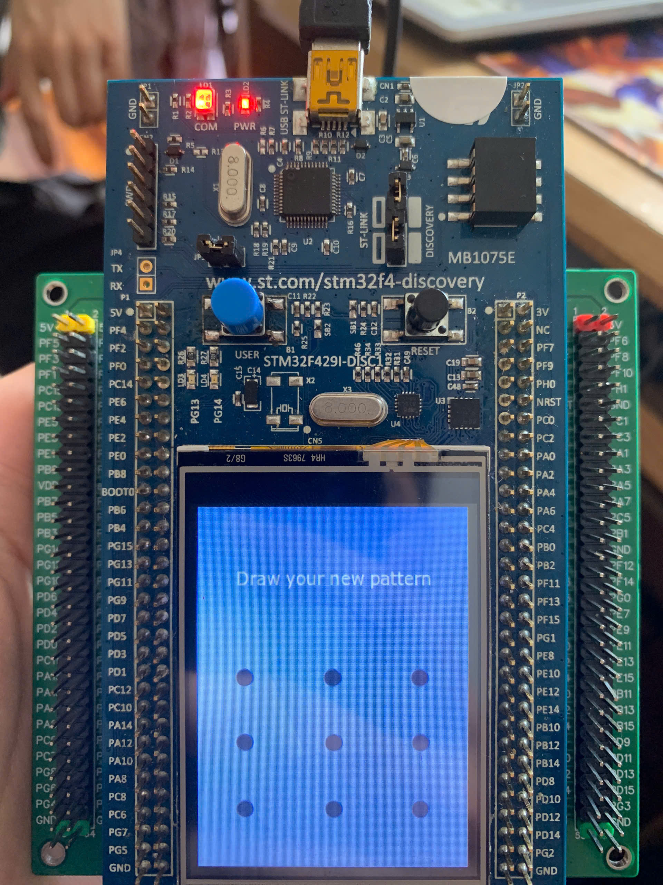
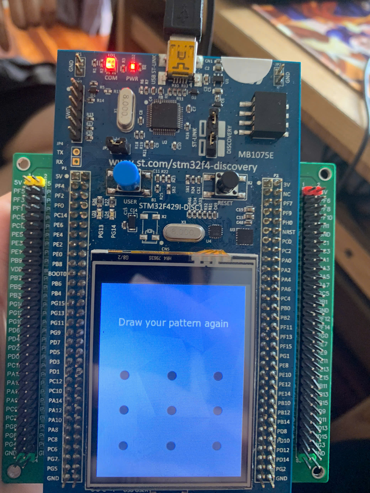
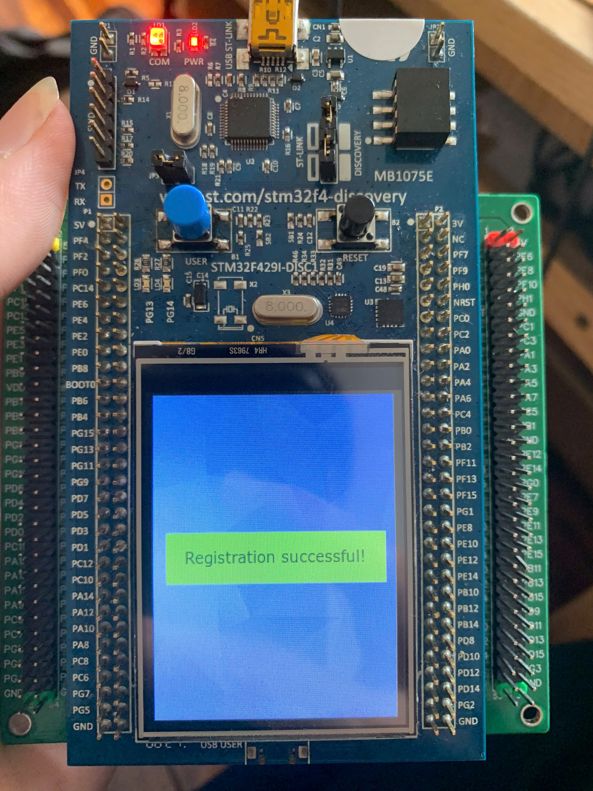

# PROJECT SAMPLE

## GIỚI THIỆU

__Đề bài__:
Sử dụng STM32F429 và TouchGFX để tạo chức năng unlock bằng pattern giống như trên điện thoại với 3 chức năng: đăng kí, kiểm tra, và lưu trữ. Nếu người dùng bấm và giữ nút Boot có sẵn trên kit trong 3 giây thì hệ thống chuyển sang trạng thái đăng kí pattern, confirm và lưu trữ pattern trong vùng nhớ flash vĩnh viễn để có thể đọc khi khởi động lại thiết bị. Ở trang thái bình thường, thiết bị ở trạng thái khóa và hiển thị 9 điểm để user nhập pattern. User unlock thành công thì màn hình hiện ra dòng thông báo, và tự quay về trạng thái khóa sau vài giây.

__Sản phẩm:__
Sản phẩm là một hệ thống khóa màn hình bằng pattern, được xây dựng trên kit STM32F429.
1.  **Tính năng Đăng ký Pattern**: Cho phép người dùng thiết lập và lưu một pattern mới vào bộ nhớ flash của thiết bị. Chức năng này được kích hoạt bằng cách giữ nút 'USER' trong 3 giây.
2.  **Tính năng Xác thực Pattern**: Ở chế độ mặc định, người dùng có thể vẽ pattern để mở khóa. Hệ thống sẽ so sánh pattern được vẽ với pattern đã lưu.
3.  **Tính năng Khóa tạm thời**: Nếu nhập sai pattern quá 5 lần, hệ thống sẽ tự động khóa, không cho phép tương tác trong 30 giây.

-   Ảnh chụp minh họa:
    <p align="center">
      
    </p>
    <p align="center"><em>Giao diện khi vẽ pattern</em></p>

## TÁC GIẢ

Danh sách thành viên thực hiện dự án:

| STT | Họ tên           | MSSV     | Công việc                                                                                  |
|:--:|------------------|----------|--------------------------------------------------------------------------------------------|
| 1  | Trần Quang Huy   | 20225201 | Thiết kế giao diện, xử lý vẽ line, xây dựng logic hoạt động cơ bản, đếm ngược 30s, báo cáo |
| 2  | Đỗ Dương Nghiêm  | 20225370 | Chức năng đăng ký pattern, thiết kế giao diện đăng ký, làm báo cáo                        |
| 3  | Nguyễn Đăng Khánh| 20225343 | Chức năng xác thực pattern, xây dựng logic hoạt động cơ bản, làm báo cáo                  |


## MÔI TRƯỜNG HOẠT ĐỘNG

-   **Dev kit**: Hệ thống được xây dựng hoàn toàn trên kit phát triển STM32F429I-DISC1.
-   **Module sử dụng**: Không sử dụng module ngoài, tận dụng các thành phần có sẵn trên kit.

## SƠ ĐỒ KẾT NỐI

Hệ thống sử dụng các linh kiện được tích hợp sẵn trên kit STM32F429I-DISC1, không yêu cầu kết nối dây ngoài.

|Thành phần trên kit|Chức năng|
|--|--|
|MCU STM32F429ZIT6|Vi điều khiển trung tâm, xử lý mọi logic|
|Màn hình LCD 2.4 inch|Hiển thị giao diện đồ họa và các thông báo trạng thái|
|Cảm ứng điện dung|Nhận thao tác chạm, vẽ của người dùng|
|Nút nhấn "USER" (PA0)|Kích hoạt chế độ đăng ký pattern|

### TÍCH HỢP HỆ THỐNG

-   **Thành phần phần cứng và vai trò:**
    * **Vi điều khiển STM32F429ZIT6**: Là trung tâm xử lý, nhận tín hiệu từ màn hình cảm ứng và nút nhấn, xử lý logic và gửi lệnh hiển thị ra màn hình LCD.
    * **Màn hình cảm ứng**: Là thiết bị nhập liệu chính, cho phép người dùng vẽ pattern bằng cách gửi tọa độ điểm chạm về vi điều khiển.
    * **Nút nhấn "USER"**: Thiết bị nhập liệu phụ, dùng để gửi tín hiệu yêu cầu chuyển sang chế độ đăng ký.
    * **Màn hình LCD**: Là thiết bị hiển thị, nhận dữ liệu hình ảnh từ vi điều khiển để hiển thị giao diện, đường nối và các thông báo.

-   **Thành phần phần mềm và vai trò:**
    * **TouchGFX Framework**: Nằm trên vi điều khiển, cung cấp thư viện để thiết kế và chạy giao diện người dùng đồ họa (GUI).
    * **Kiến trúc Event-Driven**: Hệ thống được xây dựng theo mô hình hướng sự kiện, phản hồi lại các tương tác của người dùng (chạm, vuốt) và sự kiện thời gian.
    * **Lớp `DrawView`**: Là trung tâm của ứng dụng, chứa logic chính để xử lý các sự kiện và quản lý trạng thái giao diện.

### ĐẶC TẢ HÀM

-   Giải thích một số hàm quan trọng:

    ```C
    /**
     * @brief Hàm vẽ một đường thẳng nối 2 điểm pattern cuối cùng.
     * @note Hàm này không có tham số vào/ra. Nó đọc trạng thái từ các biến
     * thành viên như patternBuffer, patternLength, và currentLineIndex
     * để xác định vị trí và widget đường thẳng cần vẽ.
     */
    void DrawView::drawLineBetweenLastTwoDots();
    ```

    ```C
    /**
     * @brief Hàm chuyển hệ thống sang chế độ đăng ký pattern.
     * @note Hàm này không có tham số vào/ra. Nó thực hiện việc reset các
     * cờ trạng thái, dọn dẹp giao diện và hiển thị thông báo yêu cầu
     * người dùng vẽ pattern mới.
     */
    void DrawView::enterRegisterMode();
    ```

    ```C
    /**
    * @brief Xử lý sự kiện khi người dùng nhấc ngón tay khỏi màn hình.
    * @param evt Đối tượng sự kiện chứa thông tin về loại sự kiện (PRESSED/RELEASED).
    * @note Đây là hàm xử lý logic chính. Khi người dùng hoàn tất việc vẽ,
    * hàm này sẽ được gọi để bắt đầu quá trình xác thực pattern hoặc
    * xử lý các bước đăng ký.
    */
    void DrawView::handleClickEvent(const touchgfx::ClickEvent& evt);
    ```

    ```C
    /**
    * @brief Xử lý tất cả các logic liên quan đến thời gian.
    * @note Hàm này được hệ thống TouchGFX tự động gọi 60 lần mỗi giây.
    * Nó chịu trách nhiệm quản lý các bộ đếm giờ, ví dụ như tự động
    * ẩn thông báo thành công sau 5 giây, hoặc đếm ngược 30 giây
    * khi màn hình bị khóa.
    */
    void DrawView::handleTickEvent();
    ```

    ```C
    /**
    * @brief Xử lý logic cho quy trình đăng ký pattern gồm 2 bước.
    * @note Hàm này kiểm tra xem người dùng đang ở giai đoạn nào (nhập lần đầu
    * hay xác nhận), lưu pattern tạm thời và so sánh để đảm bảo
    * hai lần nhập trùng khớp trước khi lưu vào bộ nhớ flash.
    */
    void DrawView::processRegisterPattern();
    ```

    

### KẾT QUẢ

-   **Video sản phẩm:**
    * Demo chức năng đăng nhập: [https://drive.google.com/file/d/1c8_4mMS5QDQ4flgI7kHTLKitF2zJSYOR/view?usp=sharing](https://drive.google.com/file/d/1c8_4mMS5QDQ4flgI7kHTLKitF2zJSYOR/view?usp=sharing)
    * Demo chức năng đăng ký: [https://drive.google.com/file/d/1kPIOrM41LUIyXJbkvxfkCYl9QhLklZDE/view?usp=sharing](https://drive.google.com/file/d/1kPIOrM41LUIyXJbkvxfkCYl9QhLklZDE/view?usp=sharing)

-   **Ảnh chụp sản phẩm:**

    <p align="center">
      
    </p>
    <p align="center"><em>Giao diện khởi tạo</em></p>

    <p align="center">
      
    </p>
    <p align="center"><em>Giao diện khi vẽ sai</em></p>

    <p align="center">
      
    </p>
    <p align="center"><em>Giao diện mở khóa thành công</em></p>

    <p align="center">
      
    </p>
    <p align="center"><em>Giao diện khi bị khóa 30 giây</em></p>

    <p align="center">
      
    </p>
    <p align="center"><em>Giao diện khi đăng ký pattern</em></p>

    <p align="center">
      
    </p>
    <p align="center"><em>Giao diện khi xác thực pattern</em></p>

    <p align="center">
      
    </p>
    <p align="center"><em>Giao diện đăng ký thành công</em></p>

    <p align="center">
      
    </p>
    <p align="center"><em>Giao diện đăng ký thất bại</em></p>
